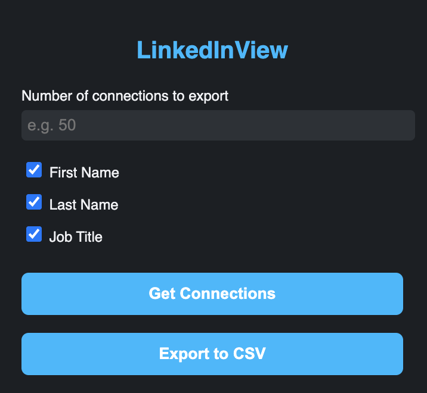

# 🔍 LinkedInView — LinkedIn Network Extractor

A powerful Chrome Extension that helps you extract and export key information from your LinkedIn connections — **without** needing LinkedIn's API or developer access.

---

## ✨ Features

- ✅ Extract First Name, Last Name, and Job Title
- ✅ Custom field selection via checkboxes
- ✅ Limit number of connections to extract
- ✅ One-click export to CSV
- ✅ No data stored externally — all local and private
- ✅ Clean, dark mode UI inspired by LinkedIn but uniquely styled

---

## 🚀 How to Use

1. Clone or download this repo.
2. Open `chrome://extensions` in your Chrome browser.
3. Enable **Developer Mode** (top right).
4. Click **Load unpacked** and select this folder.
5. Open [LinkedIn Connections](https://www.linkedin.com/mynetwork/invite-connect/connections/).
6. Click the extension icon and:
   - Choose what to extract (fields, limit).
   - Click **Get Connections**.
   - Click **Export to CSV** to download your data.

---

## 🛠 Tech Stack

- Manifest V3 (Chrome Extensions)
- Vanilla JavaScript
- DOM Scraping
- Chrome Storage & Messaging APIs

---

## ⚠️ Disclaimer

> This project is not affiliated with or endorsed by LinkedIn. Use it **at your own risk**. Scraping LinkedIn data may violate their Terms of Service. This tool is for **personal use only**.

---

## 📄 License

MIT License. Use freely and responsibly.
